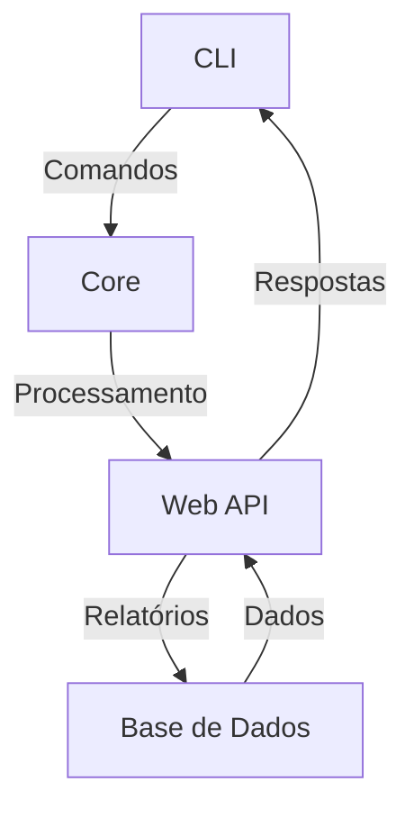
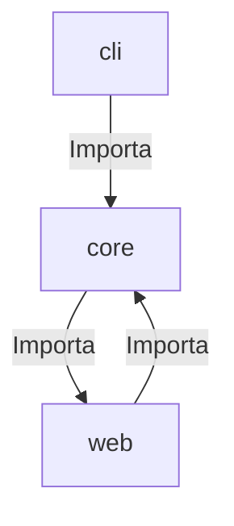

# Diagramas da Auditoria — urban-hack-sentinel

## Diagrama de Fluxo de Dados/Arquitetura de Alto Nível

## Grafo de Dependências entre Módulos/Pacotes Internos

## Notas sobre os Diagramas
- O diagrama de fluxo de dados mostra a interação entre a CLI, o Core, a Web API e a Base de Dados.
- O grafo de dependências destaca o ciclo de dependência entre `core` e `web`.
