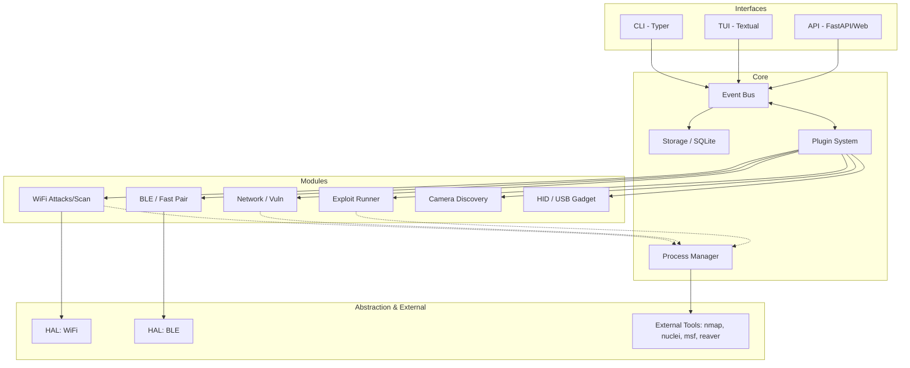
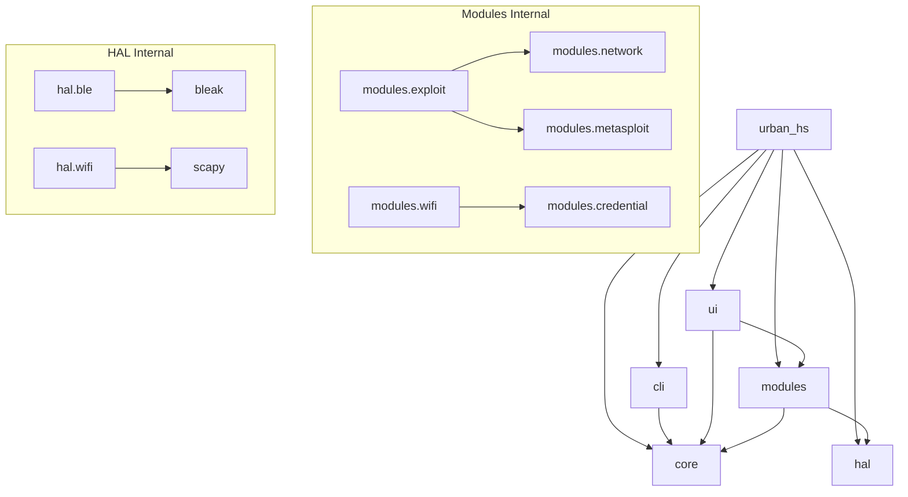

# Diagramas de Auditoria - Urban Hack Sentinel
Modelo: gemini_3_1_pro

## 1. Arquitetura de Alto Nível e Fluxo de Dados

Este diagrama ilustra a separação de responsabilidades entre as interfaces de utilizador (UI), o Core (orquestração), os Módulos (lógica de ataque/scanning) e a Camada de Abstração de Hardware (HAL).

## 2. Grafo de Dependências Internas

Mapeamento de como os pacotes internos se interligam. Destaca-se a forte dependência cruzada entre os módulos (ex: Exploit Runner depende de Network e Metasploit) e a dependência geral do Core.

