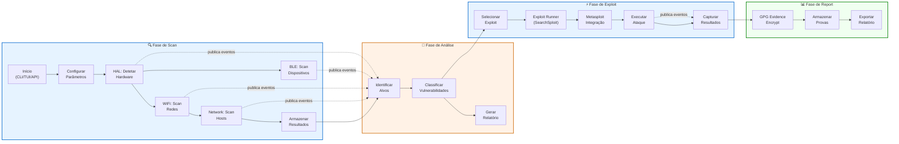

# Diagramas de Arquitetura — Urban Hack Sentinel v3
**Auditor:** mistral_medium_3_5  
**Data:** 2026-06-30  
**Versão:** 1.0

---

## Índice
1. [Diagrama de Fluxo de Dados / Arquitetura de Alto Nível](#1-diagrama-de-fluxo-de-dados--arquitetura-de-alto-nível)
2. [Grafo de Dependências entre Módulos/Pacotes Internos](#2-grafo-de-dependências-entre-módulosacotes-internos)
3. [Legenda e Convenções](#3-legenda-e-convenções)

---


## 1. Diagrama de Fluxo de Dados / Arquitetura de Alto Nível

### 1.1 Visão Geral de Componentes

```mermaid
flowchart TB
    subgraph CLI["📋 CLI (typer)"]
        cli_main["cli/main.py"]
    end

    subgraph TUI["🖥️  TUI (textual)"]
        tui_app["ui/tui/app.py"]
        tui_widgets["ui/tui/widgets/*"]
    end

    subgraph WEB["🌐 Web API (FastAPI)"]
        api_main["ui/api/main.py"]
        api_routers["ui/api/routers/*"]
    end

    subgraph CORE["⚙️  Core"]
        core_init["core/__init__.py"]
        event_bus["core/event_bus.py"]
        config["core/config.py"]
        plugins["core/plugins.py"]
        storage["core/storage.py"]
        process_mgr["core/process_mgr.py"]
        scheduler["core/scheduler.py"]
    end

    subgraph HAL["🔌 HAL (Hardware Abstraction)"]
        hal_platform["hal/platform.py"]
        hal_wifi["hal/wifi/__init__.py"]
        hal_ble["hal/ble/__init__.py"]
    end

    subgraph MODULES["📦 Módulos"]
        mod_wifi["modules/wifi/*"]
        mod_ble["modules/ble/*"]
        mod_network["modules/network/*"]
        mod_exploit["modules/exploit/*"]
        mod_credential["modules/credential/*"]
        mod_metasploit["modules/metasploit/*"]
        mod_reporting["modules/reporting/*"]
        mod_mqtt["modules/mqtt.py"]
        mod_esp32["modules/esp32.py"]
        mod_bt_hid["modules/bt_hid.py"]
        mod_ssid_confusion["modules/ssid_confusion.py"]
    end

    subgraph EXTERNAL["🔗 Dependências Externas"]
        ext_tools["Ferramentas de Sistema\n(iw, aircrack-ng, hcxtools, etc.)"]
        ext_bleak["bleak"]
        ext_bluez["BlueZ (STUB)"]
        ext_metasploit["Metasploit Framework"]
        ext_nmap["nmap"]
        ext_nuclei["nuclei"]
        ext_hashcat["hashcat"]
        ext_scapy["scapy"]
    end

    %% Conexões entre Componentes
    cli_main -->|"comandos"| core_init
    tui_app -->|"eventos"| event_bus
    tui_app -->|"requisições"| mod_wifi
    tui_app -->|"requisições"| mod_ble
    api_main -->|"requisições"| api_routers
    api_routers -->|"operções"| core_init
    api_routers -->|"operções"| event_bus
    api_routers -->|"requisições"| mod_wifi
    api_routers -->|"requisições"| mod_ble
    api_routers -->|"requisições"| mod_network
    api_routers -->|"requisições"| mod_exploit

    %% Core <-> Módulos
    core_init -->|"event bus"| event_bus
    core_init -->|"config"| config
    core_init -->|"plugins"| plugins
    core_init -->|"storage"| storage
    core_init -->|"processos"| process_mgr
    core_init -->|"scheduler"| scheduler

    event_bus -->|"publica/subscribe"| mod_wifi
    event_bus -->|"publica/subscribe"| mod_ble
    event_bus -->|"publica/subscribe"| mod_network
    event_bus -->|"publica/subscribe"| mod_exploit
    event_bus -->|"publica/subscribe"| mod_mqtt

    %% HAL <-> Módulos (dependências identificadas)
    hal_ble -->|"usa (import)"| mod_ble
    hal_wifi -->|"usa (import)"| mod_wifi
    mod_wifi -->|"usa"| hal_wifi
    mod_ble -->|"usa"| hal_ble
    mod_exploit -->|"usa"| hal_ble
    mod_exploit -->|"usa"| hal_wifi

    %% Módulos <-> Ferramentas Externas
    mod_wifi -->|"chama"| ext_tools
    mod_wifi -->|"usa"| ext_scapy
    mod_ble -->|"usa"| ext_bleak
    mod_ble -->|"usa (STUB)"| ext_bluez
    mod_exploit -->|"chama"| ext_tools
    mod_exploit -->|"usa"| ext_metasploit
    mod_exploit -->|"usa"| ext_nmap
    mod_exploit -->|"usa"| ext_nuclei
    mod_exploit -->|"usa"| ext_hashcat
    mod_network -->|"usa"| ext_nmap
    mod_network -->|"usa"| ext_nuclei

    %% Estilo
    classDef coreStyle fill:#f9f,stroke:#333,stroke-width:2px
    classDef halStyle fill:#bbf,stroke:#333,stroke-width:2px
    classDef moduleStyle fill:#9f9,stroke:#333,stroke-width:2px
    classDef uiStyle fill:#ff9,stroke:#333,stroke-width:2px
    classDef externalStyle fill:#f96,stroke:#333,stroke-width:2px,color:#fff

    class CORE coreStyle
    class HAL halStyle
    class MODULES moduleStyle
    class CLI,TUI,WEB uiStyle
    class EXTERNAL externalStyle
```



### 1.2 Fluxo de Dados Principal (Scan → Exploit)



---


## 2. Grafo de Dependências entre Módulos/Pacotes Internos

### 2.1 Grafo Completo de Dependências

```mermaid
graph TD
    %% Core (centro do grafo)
    core["core/__init__.py"]
    core_config["core/config.py"]
    core_event_bus["core/event_bus.py"]
    core_plugins["core/plugins.py"]
    core_storage["core/storage.py"]
    core_process_mgr["core/process_mgr.py"]
    core_health["core/health.py"]
    core_scheduler["core/scheduler.py"]
    core_concurrency["core/concurrency.py"]
    core_memory["core/memory.py"]
    core_security["core/security.py"]
    core_attack_event_adapter["core/attack_event_adapter.py"]

    %% HAL
    hal["hal/__init__.py"]
    hal_platform["hal/platform.py"]
    hal_wifi["hal/wifi/__init__.py"]
    hal_ble["hal/ble/__init__.py"]

    %% Modules
    modules["modules/__init__.py"]
    mod_wifi["modules/wifi/*"]
    mod_wifi_scanner["modules/wifi/scanner.py"]
    mod_wifi_attacks["modules/wifi/attacks.py"]
    mod_wifi_managers["modules/wifi/managers.py"]
    mod_wifi_plugin["modules/wifi/plugin.py"]
    mod_ble["modules/ble/*"]
    mod_ble_fastpair["modules/ble/fastpair.py"]
    mod_ble_exploit_chain["modules/ble/exploit_chain.py"]
    mod_ble_plugin["modules/ble/plugin.py"]
    mod_network["modules/network/*"]
    mod_exploit["modules/exploit/*"]
    mod_exploit_runner["modules/exploit/runner.py"]
    mod_credential["modules/credential/*"]
    mod_credential_manager["modules/credential/manager.py"]
    mod_metasploit["modules/metasploit/*"]
    mod_reporting["modules/reporting/*"]
    mod_mqtt["modules/mqtt.py"]
    mod_esp32["modules/esp32.py"]
    mod_bt_hid["modules/bt_hid.py"]
    mod_ssid_confusion["modules/ssid_confusion.py"]
    mod_plugins["modules/plugins/*"]

    %% UI
    ui_api["ui/api/*"]
    ui_api_main["ui/api/main.py"]
    ui_tui["ui/tui/*"]
    ui_web["ui/web/*"]

    %% CLI
    cli["cli/*"]

    %% ============ DEPENDÊNCIAS ============

    %% Core -> HAL (core não importa HAL diretamente)
    
    %% HAL -> Modules (DEPENDÊNCIA CRÍTICA: hal/ble importa de modules/ble)
    hal_ble -->|"importa FastPairScanner\n(linha 18, 66)"| mod_ble_fastpair
    hal_wifi -->|"importa NetworkInfo\n(linha 9)"| mod_wifi_scanner

    %% Modules -> HAL
    mod_wifi_scanner -->|"usa"| hal_wifi
    mod_ble_fastpair -->|"usa"| hal_ble
    mod_exploit_runner -->|"usa"| hal_ble
    mod_exploit_runner -->|"usa"| hal_wifi
    mod_esp32 -->|"usa"| hal_ble

    %% Modules -> Modules (cross-module)
    mod_exploit_runner -->|"importa"| mod_metasploit
    mod_exploit_runner -->|"importa"| mod_network
    mod_ble_exploit_chain -->|"importa"| mod_ble
    mod_wifi_plugin -->|"importa"| mod_wifi_scanner
    mod_wifi_plugin -->|"importa"| mod_wifi_attacks
    mod_wifi_plugin -->|"importa"| mod_wifi_managers
    mod_ssid_confusion -->|"importa"| mod_network
    mod_ssid_confusion -->|"importa"| mod_wifi
    mod_esp32 -->|"importa"| mod_network
    mod_esp32 -->|"importa"| mod_ble
    mod_mqtt -->|"importa"| mod_network

    %% Modules -> Core
    mod_wifi_plugin -->|"importa"| core
    mod_ble_plugin -->|"importa"| core
    mod_ssid_confusion -->|"importa"| core
    mod_mqtt -->|"importa"| core
    mod_esp32 -->|"importa"| core
    mod_bt_hid -->|"importa"| core

    %% UI -> Core
    ui_api_main -->|"importa"| core
    ui_tui -->|"importa"| core

    %% UI -> Modules
    ui_api_main -->|"importa routers"| mod_wifi
    ui_api_main -->|"importa routers"| mod_ble
    ui_api_main -->|"importa routers"| mod_network
    ui_api_main -->|"importa routers"| mod_exploit
    ui_tui -->|"importa"| mod_wifi
    ui_tui -->|"importa"| mod_ble

    %% CLI -> Core
    cli -->|"importa"| core

    %% Core internals
    core -->|"importa"| core_config
    core -->|"importa"| core_event_bus
    core -->|"importa"| core_storage
    core -->|"importa"| core_process_mgr
    core -->|"importa"| core_health
    core -->|"importa"| core_scheduler
    core -->|"importa"| core_concurrency
    core -->|"importa"| core_memory
    core -->|"importa"| core_security
    core -->|"importa"| core_plugins
    core_config -->|"importa"| core_event_bus
    core_attack_event_adapter -->|"importa"| core_event_bus

    %% Modules internals
    mod_wifi -->|"importa"| mod_wifi_scanner
    mod_wifi -->|"importa"| mod_wifi_attacks
    mod_wifi -->|"importa"| mod_wifi_managers
    mod_ble -->|"importa"| mod_ble_fastpair
    mod_ble -->|"importa"| mod_ble_exploit_chain
    mod_exploit -->|"importa"| mod_exploit_runner
    mod_credential -->|"importa"| mod_credential_manager
    mod_metasploit -->|"importa"| mod_metasploit
    mod_reporting -->|"importa"| mod_reporting

    %% ============ CICLOS DE DEPENDÊNCIA ============
    %% NÃO DETETADOS: hal/ble -> modules/ble, mas modules/ble NÃO importa de hal
    %% Portanto NÃO HÁ CICLO entre HAL e Modules
    
    %% Mas hal/ble importa de modules/ble/fastpair, e hal/wifi importa de modules/wifi/scanner
    %% Esta é uma INVERSÃO de dependência: HAL (camada baixa) depende de Modules (camada alta)
    
    %% ============ ESTILO ============
    classDef coreNode fill:#f9f,stroke:#c00,stroke-width:2px,color:#000
    classDef halNode fill:#bbf,stroke:#000,stroke-width:2px,color:#fff
    classDef moduleNode fill:#9f9,stroke:#000,stroke-width:2px,color:#000
    classDef uiNode fill:#ff9,stroke:#000,stroke-width:2px,color:#000
    classDef cliNode fill:#ff9,stroke:#000,stroke-width:2px,color:#000

    class core,core_config,core_event_bus,core_plugins,core_storage,core_process_mgr,core_health,core_scheduler,core_concurrency,core_memory,core_security,core_attack_event_adapter coreNode
    class hal,hal_platform,hal_wifi,hal_ble halNode
    class modules,mod_wifi,mod_wifi_scanner,mod_wifi_attacks,mod_wifi_managers,mod_wifi_plugin,mod_ble,mod_ble_fastpair,mod_ble_exploit_chain,mod_ble_plugin,mod_network,mod_exploit,mod_exploit_runner,mod_credential,mod_credential_manager,mod_metasploit,mod_reporting,mod_mqtt,mod_esp32,mod_bt_hid,mod_ssid_confusion,mod_plugins moduleNode
    class ui_api,ui_api_main,ui_tui,ui_web uiNode
    class cli cliNode

    %% Destaque para dependências invertidas (problema de arquitetura)
    linkStyle 0,1 stroke:#f00,stroke-width:3px,stroke-dasharray: 5 5


---


## 3. Legenda e Convenções

### 3.1 Cores nos Diagramas

| Cor | Hex | Significado | Aplicado a |
|-----|-----|-------------|-----------|
| Rosa claro | #f9f | **Core** — Núcleo do sistema, infraestrutura compartilhada | `core/*` |
| Azul claro | #bbf | **HAL** — Hardware Abstraction Layer | `hal/*` |
| Verde claro | #9f9 | **Módulos** — Funcionalidades específicas | `modules/*` |
| Amarelo claro | #ff9 | **UI** — Interfaces de utilizador (CLI, TUI, Web) | `ui/*`, `cli/*` |
| Laranja | #f96 | **Dependências Externas** — Ferramentas e bibliotecas externas | Ferramentas de sistema |
| Vermelho | #f00 | **Problemas/Alertas** — Dependências invertidas ou cíclicas | Ligações problemáticas |

### 3.2 Símbolos e Linhas

| Símbolo | Significado |
|---------|-------------|
| `-->` | Dependência/Importação direta |
| `-.->` | Publicação/Subscrição de eventos (Event Bus) |
| `stroke-dasharray: 5 5` | Ligação problemática (inversão de dependência) |
| `stroke-width: 3px` | Ligação crítica ou com problema |

### 3.3 Subgrafos

- **CLI**: Interface de linha de comandos (typer)
- **TUI**: Interface textual (textual framework)
- **WEB**: API REST (FastAPI) + WebSocket
- **CORE**: Infraestrutura base (config, event bus, plugins, storage, etc.)
- **HAL**: Camada de abstração de hardware (WiFi, BLE)
- **MODULES**: Módulos funcionais (wifi, ble, network, exploit, etc.)
- **EXTERNAL**: Dependências externas (ferramentas de sistema, bibliotecas)

### 3.4 Convenções de Nomenclatura

- `nome_arquivo["caminho/para/ficheiro.py"]` — Nó representando um ficheiro ou módulo
- `subgraph LABEL["Descrição"]` — Agrupamento lógico de componentes
- `(linha X)` — Referência à linha do código onde a dependência é declarada

### 3.5 achados de Arquitetura nos Diagramas

1. **Inversão de Dependência (PROBLEMA)**: 
   - `hal/ble/__init__.py` importa de `modules/ble/fastpair.py` (linhas 18, 66)
   - `hal/wifi/__init__.py` importa de `modules/wifi/scanner.py` (linha 9)
   - **Isto viola o princípio de que HAL (camada baixa) não deve depender de Modules (camada alta)**

2. **Sem CICLOS de Dependência**: 
   - Não foram detetados ciclos circulares entre módulos
   - A dependência HAL -> Modules é uni-direcional (Modules não importa de HAL nestes casos)

3. **Event Bus como Backbone**: 
   - Todos os módulos principais subscrevem/publicam eventos
   - Permite comunicação assíncrona e desacoplada

4. **Modularidade**: 
   - Módulos são bem isolados entre si
   - Comunicação principalmente via Event Bus ou chamadas diretas controladas


---

*Fim dos Diagramas de Arquitetura — mistral_medium_3_5 — 2026-06-30*
