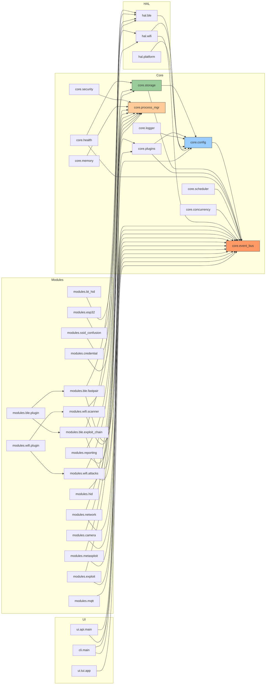

# Audit Diagrams — audit3_mimo_v2_5_free

## 1. High-Level Architecture / Data Flow

```mermaid
graph TB
    subgraph "User Interfaces"
        CLI["CLI<br/>(Typer)"]
        TUI["TUI<br/>(Textual)"]
        WEB["Web UI<br/>(HTMX + Alpine.js)"]
    end

    subgraph "API Layer"
        FASTAPI["FastAPI<br/>REST + WebSocket"]
        ROUTERS["API Routers<br/>system / wifi / ble /<br/>network / attacks / events"]
    end

    subgraph "Core Infrastructure"
        EBUS["Event Bus<br/>(asyncio.Queue pub/sub)"]
        CONFIG["Config<br/>(Pydantic Settings)"]
        STORAGE["Storage<br/>(aiosqlite WAL + Redis)"]
        PROC["Process Manager<br/>(asyncio.subprocess)"]
        HEALTH["Health + Metrics<br/>(Prometheus)"]
        PLUGINS["Plugin System<br/>(dynamic load)"]
        SCHED["Scheduler<br/>(cron/interval)"]
        LOG["Logger<br/>(structlog + JSONL)"]
        SECURITY["Security<br/>(seccomp, caps, chroot)"]
        CONC["Concurrency<br/>(resource pools)"]
        MEM["Memory Profiler<br/>(streaming parsers)"]
    end

    subgraph "Hardware Abstraction Layer"
        WIFI_HAL["WiFi HAL<br/>iw / scapy backend"]
        BLE_HAL["BLE HAL<br/>bleak backend"]
        PLAT["Platform Detect<br/>ARM64 / x86"]
    end

    subgraph "Attack Modules"
        WIFI_MOD["WiFi Module<br/>Scanner + Attacks"]
        BLE_MOD["BLE Module<br/>FastPair + WhisperPair"]
        NET_MOD["Network Module<br/>Nmap + Nuclei"]
        CAM_MOD["Camera Module<br/>mDNS + ONVIF + RTSP"]
        MSF_MOD["Metasploit Module<br/>RPC + Console"]
        HID_MOD["HID Module<br/>DuckyScript + Injector"]
        MQTT_MOD["MQTT Module<br/>Broker + Brute"]
        BT_HID["BT HID Module<br/>CVE-2023-45866"]
        EXP_MOD["Exploit Runner<br/>Generic pipeline"]
        CRED_MOD["Credential Manager<br/>Normalization + Export"]
        RPT_MOD["Reporting<br/>PDF/HTML/Markdown"]
        ESP32["ESP32 Fingerprinting<br/>CVE-2025-27840"]
        SSID["SSID Confusion<br/>CVE-2023-52424"]
    end

    subgraph "External Tools (subprocess)"
        AIRCRACK["aircrack-ng suite"]
        HCX["hcxdumptool / hcxpcapngtool"]
        REAVER["reaver / bully"]
        NMAP["nmap / nuclei"]
        HASHCAT["hashcat"]
        MSF["msfconsole / msfRPC"]
        BLUEZ["BlueZ / bluetoothctl"]
        GPSD["gpsd"]
    end

    subgraph "Chroot (optional)"
        ALPINE["Alpine Linux Chroot<br/>Isolated tool execution"]
    end

    CLI --> FASTAPI
    TUI --> FASTAPI
    WEB --> FASTAPI
    FASTAPI --> ROUTERS
    ROUTERS --> EBUS
    ROUTERS --> WIFI_MOD
    ROUTERS --> BLE_MOD
    ROUTERS --> NET_MOD

    EBUS --> PLUGINS
    PLUGINS --> WIFI_MOD
    PLUGINS --> BLE_MOD
    PLUGINS --> NET_MOD
    PLUGINS --> CAM_MOD
    PLUGINS --> MSF_MOD
    PLUGINS --> HID_MOD
    PLUGINS --> MQTT_MOD
    PLUGINS --> BT_HID
    PLUGINS --> EXP_MOD
    PLUGINS --> CRED_MOD
    PLUGINS --> RPT_MOD
    PLUGINS --> ESP32
    PLUGINS --> SSID

    WIFI_MOD --> WIFI_HAL
    BLE_MOD --> BLE_HAL
    WIFI_HAL --> AIRCRACK
    WIFI_HAL --> HCX
    WIFI_HAL --> REAVER
    NET_MOD --> NMAP
    MSF_MOD --> MSF
    EXP_MOD --> HASHCAT
    RPT_MOD --> PROC

    PROC --> ALPINE
    PLAT --> WIFI_HAL
    PLAT --> BLE_HAL

    STORAGE --> CONFIG
    HEALTH --> EBUS
    LOG --> EBUS
    CONC --> EBUS
    MEM --> PROC
    SECURITY --> PROC

    WIFI_HAL --> EBUS
    BLE_HAL --> EBUS
    NET_MOD --> EBUS
    MSF_MOD --> EBUS
```

## 2. Internal Module Dependency Graph

**Cycle detected:** `core.storage` → `core.config` and `core.config` → `core.event_bus` → `core.storage` forms a cycle: `storage → config → event_bus → storage`. This is an **implicit circular dependency** mediated through the global singleton pattern (`get_config()`, `get_event_bus()`, `get_storage()`). No import cycle exists, but the runtime dependency is circular.
